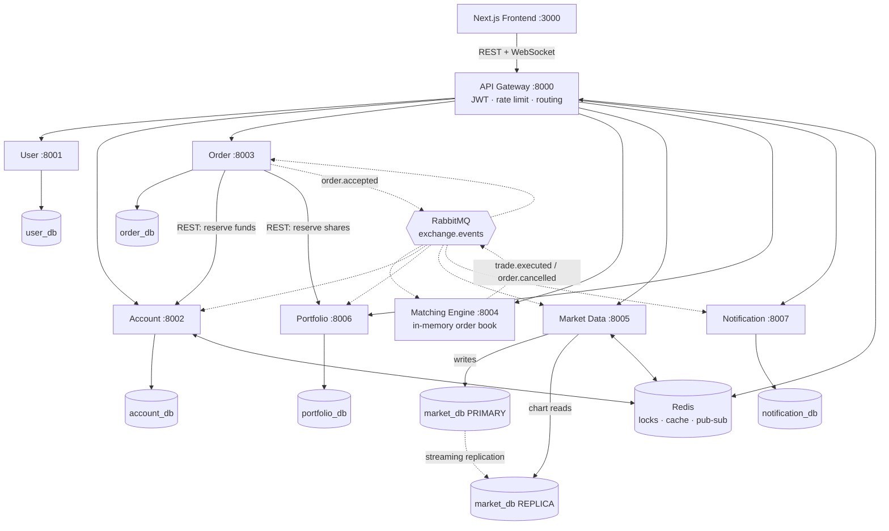

# Mini Stock Exchange Platform

A microservices-based paper-trading exchange. Users register, deposit virtual funds, watch live
prices and candlestick charts, place limit and market orders, and have those orders **matched
against each other** by a real price–time-priority matching engine — with the fill then settled
across cash, holdings, P&L and notifications.

**Course:** SWE 4602 — Software Design & Architectures
**Institution:** Islamic University of Technology, Department of CSE

| # | Name | ID | Built |
|---|---|---|---|
| 1 | Arham Ibrahim Khan | 220042160 | Notification Service · API Gateway · infrastructure & integration |
| 2 | Arham Apon Utsho | 220042153 | User Service · Account Service · auth & wallet UI |
| 3 | Abidur Rahman Asif | 220042152 | Order Service · Matching Engine · trading UI |
| 4 | Mustain Billah Taj | 220042166 | Market Data Service · Portfolio Service · charts & portfolio UI |

---

## Quick start

Requires Docker Desktop with **8 GB** of memory allocated.

```bash
git clone https://github.com/arhamkhan160/Mini-Stock-Exchange-Platform.git
```

```bash
cd Mini-Stock-Exchange-Platform && cp .env.example .env
```

```bash
docker compose up -d --build
```

Then fill the exchange with market history and live trading activity:

```bash
python infra/seed/seed_market_data.py && python infra/seed/seed_demo_data.py
```

Open **http://localhost:3000** and sign in:

| Account | Password |
|---|---|
| `demo@mse.local` | `DemoPassw0rd!` |
| `trader00@mse.local` … `trader13@mse.local` | `SeedPassw0rd!` |

The `trader*` accounts hold positions and open orders, so the portfolio, orders and wallet pages
have real data in them. `demo` starts flat, which is the better account to demonstrate placing a
first order.

| Surface | URL |
|---|---|
| Web app | http://localhost:3000 |
| API Gateway | http://localhost:8000 |
| Swagger per service | http://localhost:8001/docs … http://localhost:8007/docs |
| RabbitMQ management | http://localhost:15672 |

Every published port binds to `127.0.0.1`, so the stack is reachable only from your machine. Redis
has no password and RabbitMQ uses the credentials in `.env`; on a shared network an unbound port
would expose both. Drop the `127.0.0.1:` prefix in `docker-compose.yml` only if you deliberately
need remote access.

The credentials in `.env.example` are development defaults created by the containers on first boot.
Production would inject them from a secrets manager.

---

## Architecture



Solid arrows are synchronous HTTP; dotted arrows are asynchronous events.

| Service | Port | Owns |
|---|---|---|
| **User** | 8001 | Identities, password hashes, JWT issuing |
| **Account** | 8002 | Virtual cash, funds reservations, settlement ledger |
| **Order** | 8003 | Order lifecycle and the place-order saga |
| **Matching Engine** | 8004 | In-memory order books, price–time priority *(no database, by design)* |
| **Market Data** | 8005 | Trades, OHLC candles, live ticks — primary + read replica |
| **Portfolio** | 8006 | Holdings, average cost, P&L, share reservations |
| **Notification** | 8007 | Fill / cancellation / rejection alerts |

Full reasoning for each boundary is in [docs/architecture.md](docs/architecture.md).

---

## How a trade flows

1. **Register / login** — Frontend → Gateway → User Service, which returns a JWT.
2. **Browse** — candle history from the **read replica**, live ticks over a WebSocket.
3. **Place a limit buy** — Frontend → Gateway → Order Service.
4. Order Service calls Account Service, which takes a **Redis lock** on the balance, verifies buying
   power and **reserves** the funds. A sell reserves *shares* in the Portfolio Service instead.
5. The order is persisted `NEW` and **`order.accepted`** is published.
6. The Matching Engine matches it by price–time priority, or rests it, and publishes
   **`trade.executed`** per fill.
7. Consumers react: Order updates status, Account settles cash both ways, Portfolio updates holdings
   and P&L, Market Data writes the trade, updates candles and broadcasts a tick.
8. Notification Service sends the alert; the UI updates live over its WebSocket.
9. **If any step fails**, compensating actions release the reserved funds or shares and the order is
   marked `REJECTED`.

Trades execute at the **resting order's price**, so the aggressor receives any price improvement —
a buy limit of 200.00 against a resting ask of 195.70 fills at 195.70, and the over-reservation is
returned. Cancellation is two-phase: only the book knows whether an order was still resting, so the
Matching Engine publishes the authoritative `order.cancelled`.

See [docs/sequence-place-order.md](docs/sequence-place-order.md) for the saga and its failure paths.

---

## Architectural patterns

| Pattern | Where |
|---|---|
| API Gateway with cross-cutting concerns | [`services/gateway/`](services/gateway/) — routing, JWT, rate limiting, WS proxy |
| Synchronous inter-service REST | `Order → Account`, `Order → Portfolio` via [`libs/common/http_client.py`](libs/common/http_client.py) |
| Asynchronous event-driven messaging | RabbitMQ topic exchange — [`libs/common/events.py`](libs/common/events.py), [docs/events.md](docs/events.md) |
| Database per service | 7 PostgreSQL instances, one Alembic history each |
| **Master–slave replication** | [`infra/postgres/`](infra/postgres/) — Market Data writes primary, reads replica |
| Saga with compensating actions | Order Service place-order flow |
| CQRS read projection | Portfolio Service, built from `trade.executed` |
| Distributed locking | Redis `SET NX PX` + Lua compare-and-delete release |
| Caching & Pub/Sub fan-out | `md:last_price:*`, channel `md:ticks` |
| Order matching | In-memory book per symbol, price–time priority, self-trade prevention |
| Real-time delivery | WebSockets, proxied through the gateway |
| Service discovery | Docker Compose DNS on the `mse-net` network |
| Circuit breaker & bulkhead | [`services/gateway/app/proxy.py`](services/gateway/app/proxy.py) |

### Verifying the replication

```bash
docker compose exec postgres-market-primary psql -U mse -d market_db -c "SELECT client_addr, state, sync_state FROM pg_stat_replication;"
```

```bash
docker compose exec postgres-market-replica psql -U mse -d market_db -c "SELECT pg_is_in_recovery();"
```

Expect one row in `streaming` state, and `t`. The Market Data service logs `pg_is_in_recovery` for
its read engine at startup, and writing to the replica correctly fails with
`cannot execute INSERT in a read-only transaction`.

---

## Testing

Everything runs without a test framework — plain asserts, so there is nothing extra to install.

```bash
python tests/run_all.py
```

| Suite | Needs a running stack | Covers |
|---|---|---|
| `tests/test_contract.py` | no | `libs/common`: money rules, symbols, event envelope, queue uniqueness, JWT |
| `tests/test_routes.py` | no | All 23 gateway routes in-process: upstream, path rewrite, auth, rate limits |
| `tests/test_live_routes.py` | **yes** | Real HTTP + the full event path: RabbitMQ → consumer → Postgres → gateway |
| `scripts/smoke_test.py` | **yes** | End-to-end business flow: register → deposit → trade → settle → notify |
| `scripts/verify_stack.py` | **yes** | Health, JWT agreement across containers, queues, replication, frontend |
| `services/*/selfcheck.py` | mixed | Per-service logic and edge cases |

```bash
python scripts/verify_stack.py
```

```bash
python scripts/smoke_test.py
```

⚠️ The **User** and **Account** self-checks delete every row in their tables. They refuse to run
unless you opt in explicitly, so they cannot wipe seeded data by accident:

```bash
SELFCHECK_DESTRUCTIVE=1 python services/account-service/selfcheck.py
```

---

## Repository layout

```
.
├── libs/common/          shared contract: events + broker, JWT, money rules,
│                         Redis lock/idempotency, async DB helpers, HTTP client
├── services/
│   ├── gateway/          API gateway (no database)
│   ├── user-service/     account-service/     order-service/
│   ├── matching-engine/  market-data-service/ portfolio-service/
│   └── notification-service/
├── frontend/             Next.js 14 app (App Router, Tailwind, lightweight-charts)
├── infra/
│   ├── postgres/         streaming replication init scripts
│   └── seed/             candle history, demo trading data, market-maker bot
├── tests/                contract and route suites
├── scripts/              smoke test, stack verifier
├── docs/                 architecture, use cases, sequences, event catalog
└── docker-compose.yml    18 containers
```

---

## Conventions

These are enforced across every service; breaking one is the fastest way to produce wrong numbers.

- **Money** is `Decimal`, 4 decimal places, `ROUND_HALF_UP`, stored `NUMERIC(18,4)` and transported
  as a JSON **string**. Never a float. The one exception is `/market/candles`, which returns numbers
  because the charting library requires them.
- **Quantity** is a positive integer — whole shares only.
- **Every event handler is idempotent**, and idempotency is **database-first**: the
  `processed_events` primary key is the authority, written in the same transaction as the work.
  Redis is only a fast-path cache and is set *after* the commit, so a crash mid-handler can never
  make unprocessed work look processed.
- **A failing handler never blocks its queue** — the message goes to a `<queue>.retry` companion
  with a TTL and is dead-lettered after 5 attempts.
- **`JWT_SECRET` is identical in every container**, and each service logs a fingerprint of it at
  startup so a mismatch shows up in the logs instead of as unexplained 401s.

## Documentation

| Document | Contents |
|---|---|
| [docs/architecture.md](docs/architecture.md) | Service boundaries, patterns and trade-offs |
| [docs/use-cases.md](docs/use-cases.md) | Use-case diagram and per-case flows |
| [docs/sequence-place-order.md](docs/sequence-place-order.md) | The saga, compensations, two-phase cancel |
| [docs/events.md](docs/events.md) | Event envelope, payloads, queues, consumer rules |
| `services/*/SERVICE_NOTES.md` | Per-service endpoints, edge cases and known limits |

## Known limitations

- The order book is in memory, so a matching-engine restart loses resting orders; it rebuilds from
  the Order Service's open orders on boot.
- Replica lag means a chart read immediately after a trade can miss the newest candle. The frontend
  also applies the live tick, so this is not visible to the user.
- `processed_events` grows without bound; production would prune old rows.
- The gateway rate-limit window is fixed rather than sliding, so a burst straddling a minute
  boundary can briefly allow up to twice the limit.

## License

Academic coursework — Islamic University of Technology, SWE 4602.
