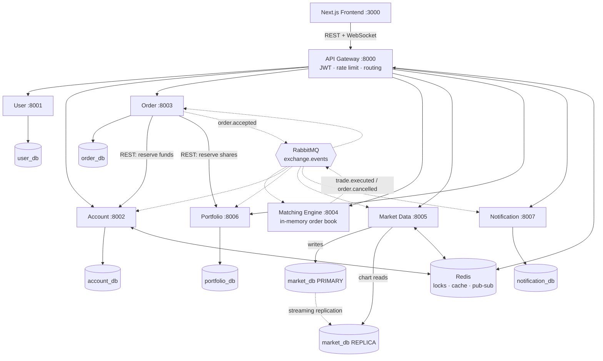

# Mini Stock Exchange Platform

A microservices-based paper-trading exchange. Users register, deposit virtual funds, watch live
prices and candlestick charts, place limit/market orders, and have those orders **matched against
each other** by a real price–time-priority matching engine — then see the fill reflected in their
cash balance, holdings, P&L and notifications.

**Course:** SWE 4602 — Software Design & Architectures
**Institution:** Islamic University of Technology, Department of CSE

| # | Name | ID | Owns |
|---|---|---|---|
| 1 | Arham Ibrahim Khan | 220042160 | Notification Service · API Gateway · platform & integration |
| 2 | Arham Apon Utsho | 220042153 | User Service · Account Service |
| 3 | Abidur Rahman Asif | 220042152 | Order Service · Matching Engine |
| 4 | Mustain Billah Taj | 220042166 | Market Data Service · Portfolio Service |

> **Status: in active development.** The platform layer is in place — shared contract
> (`libs/common/`), frontend shell, Docker Compose stack with PostgreSQL streaming replication,
> the **API Gateway** and the **Notification Service**. The remaining five services are being built
> in parallel by their owners.

## Documentation

| Document | Contents |
|---|---|
| [docs/architecture.md](docs/architecture.md) | System diagram, why each service is separate, every architectural pattern and its trade-offs |
| [docs/use-cases.md](docs/use-cases.md) | Use-case diagram and per-use-case flows, including alternates |
| [docs/sequence-place-order.md](docs/sequence-place-order.md) | The place-order saga, its compensating actions, and two-phase cancellation |
| [docs/events.md](docs/events.md) | Event envelope, exact payloads, queue bindings, and the rules every consumer follows |

---

## Architecture



### The seven services

| Service | Port | Responsibility |
|---|---|---|
| **User** | 8001 | Registration, login, JWT issuing, profile management |
| **Account** | 8002 | Virtual cash, deposits, buying-power checks, Redis-locked funds reservations, settlement |
| **Order** | 8003 | Order intake and validation, full lifecycle, and the place-order **saga** with compensating actions |
| **Matching Engine** | 8004 | In-memory limit order book per symbol, price–time priority, emits trade executions |
| **Market Data** | 8005 | Consumes trades, aggregates 1m/5m OHLC candles, serves chart history from a **read replica**, fans out live ticks over WebSocket |
| **Portfolio** | 8006 | Holdings, average cost, realized/unrealized P&L as a CQRS projection; owns share reservations for SELL orders |
| **Notification** | 8007 | Asynchronous fill / cancellation / rejection alerts (mock email + in-app) |

Supporting: **API Gateway** (single entry point, JWT validation, Redis rate limiting, WebSocket proxy),
**RabbitMQ** (event backbone), **Redis** (distributed locks, price cache, Pub/Sub fan-out),
**PostgreSQL** (one database per service; the Market Data database runs primary + streaming replica).

### Architectural patterns demonstrated

- API Gateway with cross-cutting concerns (authentication, rate limiting)
- Synchronous inter-service communication — REST over HTTP via `httpx`
- Asynchronous, event-driven communication — RabbitMQ topic exchange
- Database-per-Service (independent data ownership, no shared schema)
- **Master–slave (primary–replica) PostgreSQL streaming replication** on the read-heavy market-data path
- Distributed locking and caching with Redis
- **Saga** coordination with compensating actions for the multi-service "place order" transaction
- CQRS-style read projection (Portfolio) updated asynchronously from trade events
- Service discovery via Docker Compose DNS

---

## Tech stack

| Layer | Technology |
|---|---|
| Frontend | Next.js 14 (App Router), React 18, TypeScript, Tailwind, `lightweight-charts` 4.2 |
| Backend | FastAPI (Python 3.11) — one application per microservice |
| API Gateway | FastAPI reverse proxy (`httpx`) with JWT validation and Redis-backed rate limiting |
| Service discovery | Docker Compose DNS (container names) |
| Sync communication | REST via `httpx` |
| Async communication | RabbitMQ (topic exchange, durable queues, dead-letter exchange) |
| Database | PostgreSQL 16 — one database per service |
| Replication | PostgreSQL streaming replication (primary for trade ingestion, replica for chart/history reads) |
| Cache / locks / pub-sub | Redis 7 |
| Real-time | WebSockets (native FastAPI), proxied through the gateway |
| Auth | JWT (HS256), OAuth2 password flow |
| ORM / migrations | SQLAlchemy 2.0 (async) + Alembic |
| Containers | Docker, Docker Compose |
| API docs | Swagger / OpenAPI (auto-generated by FastAPI) |

---

## Repository layout

```
.
├── libs/common/                  # SHARED CONTRACT — frozen. Events, JWT, money, Redis, broker, DB
│   ├── config.py                 #   environment settings (identical var names everywhere)
│   ├── security.py               #   JWT create/decode, get_current_user, internal-key guard
│   ├── money.py                  #   Decimal 4dp rules — no floats, ever
│   ├── symbols.py                #   the 8 tradable symbols + seed prices
│   ├── events.py                 #   event catalog, envelope, Broker (retry + dead-letter)
│   ├── redis_client.py           #   distributed lock (Lua CAS), idempotency guard, price cache
│   ├── db.py                     #   async engine/session helpers + Alembic sync-URL conversion
│   ├── http_client.py            #   service-to-service calls with bounded retry
│   └── logging_setup.py          #   single-line JSON logging
│
├── frontend/                     # Next.js app — shell is committed, pages are per-owner
│   ├── lib/                      #   api client, auth context, WebSocket client, formatters, types
│   ├── components/               #   design system (ui.tsx), Navbar, Toast, Protected, …
│   └── app/                      #   routes
│
├── services/                     # one folder per microservice (added by each owner)
├── infra/                        # Postgres replication scripts, seeders, market-maker bot
├── docs/                         # architecture, use cases, sequence diagrams, event catalog
├── scripts/                      # end-to-end smoke test
├── requirements-base.txt         # pinned Python dependency set shared by every service
└── docker-compose.yml            # the whole stack
```

---

## Getting started

> Requires Docker Desktop with **at least 8 GB** of memory allocated.

```bash
git clone https://github.com/arhamkhan160/Mini-Stock-Exchange-Platform.git
cd Mini-Stock-Exchange-Platform
cp .env.example .env
docker compose up -d --build
```

Then seed market history and start the market-maker bot so the book and charts are alive:

```bash
python infra/seed/seed_market_data.py && python infra/seed/market_maker.py
```

Verify the whole flow end to end:

```bash
python scripts/smoke_test.py
```

| What | Where |
|---|---|
| Web app | http://localhost:3000 |
| API Gateway | http://localhost:8000 |
| Swagger (per service) | http://localhost:8001/docs … http://localhost:8007/docs |
| RabbitMQ management | http://localhost:15672 (guest / guest) |

Every published port is bound to `127.0.0.1`, so the stack is reachable from your machine only.
Redis runs without a password and RabbitMQ uses its default credentials — on a shared network an
unbound port would expose both. Drop the `127.0.0.1:` prefix on a port in `docker-compose.yml` if
you deliberately need to reach it from another machine.

The credentials in `.env.example` are development defaults, created by the containers themselves on
first boot. Production would inject them from a secrets manager instead.

Verify the master–slave replication:

```bash
docker compose exec postgres-market-primary psql -U mse -d market_db -c "SELECT client_addr,state,sync_state FROM pg_stat_replication;"
```

```bash
docker compose exec postgres-market-replica psql -U mse -d market_db -c "SELECT pg_is_in_recovery();"
```

Expect one row in `streaming` state, and `t`.

---

## How a trade flows through the system

1. **Register / login** — Frontend → Gateway → User Service, which returns a JWT.
2. **Browse** — Frontend → Gateway → Market Data: candle history from the **read replica**, live ticks over WebSocket.
3. **Place a limit buy** — Frontend → Gateway → Order Service.
4. Order Service synchronously calls Account Service, which takes a **Redis lock** on the user's balance, verifies buying power and **reserves** the funds. (A sell instead reserves *shares* in the Portfolio Service.)
5. Order Service persists the order as `NEW` and publishes **`order.accepted`**.
6. The Matching Engine matches it against the opposite side of the book by price–time priority — or rests it — and publishes **`trade.executed`** for each fill.
7. Consumers react: Order Service updates the status, Account Service settles cash between both parties, Portfolio Service updates both users' holdings and P&L, Market Data updates candles and broadcasts the new tick.
8. Notification Service sends the fill alert; the frontend reflects the trade live over its WebSocket subscription.
9. **If any step fails**, compensating actions run — the reserved funds or shares are released and the order is marked `REJECTED`.

Cancellation is two-phase: the Order Service publishes `order.cancel_requested`, and the **Matching Engine** publishes the authoritative `order.cancelled` once the order is actually removed from the book. This is a deliberate refinement of the original design — only the book knows whether the order was still resting, so releasing funds any earlier would race against a simultaneous fill.

---

## Proposal requirement → implementation

| Requirement | Where it lives |
|---|---|
| API Gateway routing and cross-cutting concerns | [`services/gateway/app/routing.py`](services/gateway/app/routing.py), [`auth.py`](services/gateway/app/auth.py), [`ratelimit.py`](services/gateway/app/ratelimit.py) |
| JWT authentication, OAuth2 password flow | [`libs/common/security.py`](libs/common/security.py) + User Service |
| Rate limiting (Redis) | [`services/gateway/app/ratelimit.py`](services/gateway/app/ratelimit.py) — 30/min on order placement, fails open |
| Synchronous inter-service REST | [`libs/common/http_client.py`](libs/common/http_client.py); `Order → Account`, `Order → Portfolio` |
| Asynchronous event-driven communication | [`libs/common/events.py`](libs/common/events.py), [`docs/events.md`](docs/events.md) |
| Database per service | 7 PostgreSQL containers in [`docker-compose.yml`](docker-compose.yml); one Alembic history per service |
| **Master–slave replication** | [`infra/postgres/primary/init-replication.sh`](infra/postgres/primary/init-replication.sh), [`replica/setup-replica.sh`](infra/postgres/replica/setup-replica.sh); read/write split in the Market Data service |
| Distributed locking (Redis) | [`libs/common/redis_client.py`](libs/common/redis_client.py) — `SET NX PX` + Lua compare-and-delete release |
| Caching and Pub/Sub tick fan-out | `md:last_price:*`, `md:quote:*`, channel `md:ticks` |
| Saga with compensating actions | Order Service place-order flow; [`docs/sequence-place-order.md`](docs/sequence-place-order.md) |
| CQRS read projection | Portfolio Service, built from `trade.executed` |
| Order matching (price–time priority) | Matching Engine, in-memory book per symbol |
| WebSockets for live prices | Market Data `/ws/market`, bridged by [`services/gateway/app/ws_proxy.py`](services/gateway/app/ws_proxy.py) |
| Service discovery | Docker Compose DNS on the `mse-net` network |
| Notifications (mock email / in-app) | [`services/notification-service/`](services/notification-service/) |
| SQLAlchemy + Alembic | [`libs/common/db.py`](libs/common/db.py); per-service `alembic/` |
| Swagger / OpenAPI | FastAPI `/docs` on every service |
| Containerisation | [`docker-compose.yml`](docker-compose.yml), one Dockerfile per service |

## Contributing (team)

Each member works in their own folders on their own branch, against a frozen shared contract, so
nobody is blocked and merges stay conflict-free.

| Owner | Services | Branch |
|---|---|---|
| Arham Ibrahim Khan | Notification, API Gateway, platform | `main` |
| Arham Apon Utsho | User, Account | `feat/team-b-identity` |
| Abidur Rahman Asif | Order, Matching Engine | `feat/team-c-trading` |
| Mustain Billah Taj | Market Data, Portfolio | `feat/team-d-market-portfolio` |

Detailed per-owner work packages are distributed to the team directly and are **not tracked in this
repository**. Each one carries the same contract section: ports, money rules, JWT claims, gateway
routes, exact event payloads, Redis keys, internal REST endpoints, Docker/Alembic templates,
frontend page ownership, and the merge protocol. The authoritative machine-readable version of that
contract is the code in `libs/common/`.

**Rules**

- Never edit `libs/common/`, the frontend shell, `docker-compose.yml`, `.env`, or another owner's folder — message A instead.
- Money is `Decimal` with 4 decimal places and crosses the wire as a **string**. Never a float. (The only exception is `/api/market/candles`, which returns numbers because the charting library requires them.)
- Quantities are positive integers — whole shares only.
- Every event handler is idempotent: guard on `event_id` before doing anything.
- `*.sh` files must keep LF line endings (enforced by `.gitattributes`) or Linux containers refuse to start.

---

## License

Academic coursework — Islamic University of Technology, SWE 4602.
