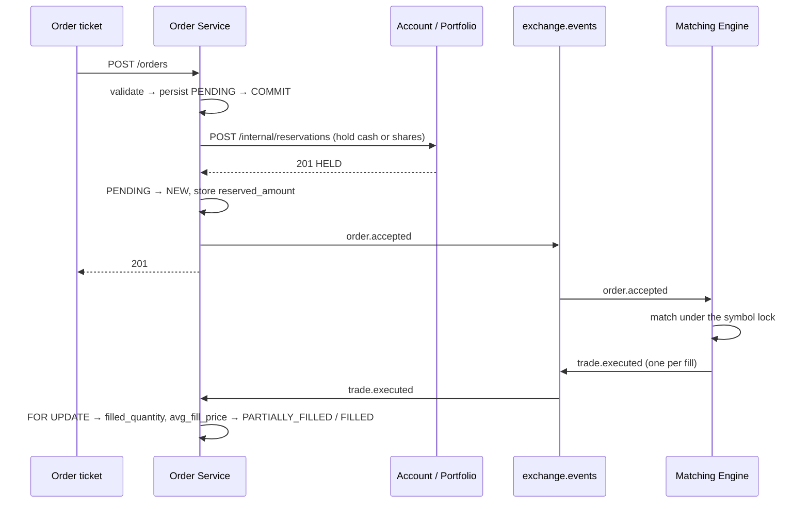

# Team C — Implementation

**Abidur Rahman Asif (220042152) · Order Service (8003), Matching Engine (8004), trading UI**
**Branch:** `feat/team-c-trading`

This explains *what was built and why it is shaped that way*. Per-service
operational detail lives in `services/order-service/SERVICE_NOTES.md` and
`services/matching-engine/SERVICE_NOTES.md`; this document is the one that ties
them together.

---

## 1. What these two services are for

Between them they own the entire life of an order.

| | Order Service (8003) | Matching Engine (8004) |
|---|---|---|
| Owns | the order **record** and its lifecycle | the order **book** |
| Storage | Postgres `order_db` | memory, by design |
| Role | saga orchestrator + compensations | pure matching + the authority on what is resting |
| Talks to | Account, Portfolio (REST); broker | broker; Order Service on boot only |

The split matters. The Order Service knows what a user *asked for*; the engine
knows what is *actually in the book right now*. Almost every non-obvious
decision below follows from keeping those two facts in separate places.

---

## 2. End-to-end flow



Cancellation runs the same way but in two phases, which is the subject of §5.

---

## 3. The Matching Engine

### 3.1 Data structures

```python
bids:  dict[Decimal, deque[BookOrder]]   # price level -> FIFO queue
asks:  dict[Decimal, deque[BookOrder]]
index: dict[str, BookOrder]              # order_id -> order, O(1) cancel
recent_trades: deque(maxlen=200)         # newest first, powers /book/{s}/trades
```

Two dicts of deques *is* a price-time-priority book. The dict gives price
priority (`max(bids)` / `min(asks)`), the deque gives time priority, and the
index makes cancellation O(1) instead of a scan of every level.

Best price is an O(levels) scan rather than a heap. With 8 symbols and a handful
of levels that is faster than a heap and impossible to get subtly wrong; the
note in `engine.py` says to revisit past ~1000 levels.

Prices are `Decimal` keys, never float, so `100.10` and `100.1` are one level
rather than two invisible ones.

### 3.2 `match()` is a pure function

`engine.py` performs no I/O — no broker, no database, no network. That single
constraint is what makes `selfcheck.py` possible: the whole algorithm, including
every edge case, is exercised in about a second with nothing running.

```python
trades, cancel_event = match(book, incoming)   # mutates the book, returns events
```

The caller publishes afterwards. Nothing is awaited inside the matching loop,
because an `await` mid-match lets the cancel consumer mutate the book underneath
the iteration.

### 3.3 The four rules that other services depend on

**The trade price is the resting order's price.** The aggressor gets the price
improvement — a buy limit of 105 crossing a resting ask of 100 trades at 100.
This is what real exchanges do, and it is why `trade.executed` carries
`buy_order_limit_price`: Account reserved against the buyer's *limit* and needs
the limit to work out how much it over-held.

**A partially filled resting order goes back to the front of its level**
(`appendleft`). `append` would silently push it behind orders that arrived
later, breaking price-time priority in a way no test notices unless you look for
it.

**Self-trade prevention skips rather than matches.** A user never trades with
themselves: P&L would be nonsense and Account would have to lock the same user
twice inside one event. Skipped orders are held aside and restored *in their
original order*. The subtle case is a level made entirely of that user's
orders — the loop drains it into the holding deque, restores it, and moves to
the next price. This is the easiest infinite loop in the project to write, so
`selfcheck.py` covers it explicitly.

**Time in force is fixed:** LIMIT is good-till-cancelled, MARKET is
immediate-or-cancel. A MARKET remainder is never rested; it comes back as
`order.cancelled` with `IOC_REMAINDER`, or `NO_LIQUIDITY` if nothing filled at
all.

### 3.4 Concurrency

One `asyncio.Lock` per symbol. Matching and cancelling the same symbol are
strictly serialised; different symbols run concurrently. Reads take the lock
too — without it a snapshot can serialise a deque mid-mutation and hand the UI a
book that never existed.

### 3.5 No database, and what that costs

Matching is a data-structure problem, and a Postgres round trip per fill would
be the slowest thing in the exchange. Two consequences, both handled rather than
hidden:

*Idempotency has no primary key to lean on.* Redelivery is caught in memory
instead: `order_id in book.index`, plus a bounded `seen_orders` map (10 000
entries) so a redelivered *fully filled* order — no longer in the index — is not
matched a second time. The same map is what lets a cancel for a vanished order
answer `ALREADY_FILLED` rather than `NOT_IN_BOOK`.

*A restart loses the book.* Closed from both sides:

* on **engine** boot it calls `GET order-service:8003/internal/orders/open` and
  re-inserts every open order with `remaining = quantity - filled_quantity` in
  `created_at` order, so time priority survives. This happens **before** the
  consumers start, or a live `order.accepted` would match against a
  half-restored book. If the call fails it logs a warning and starts empty — the
  engine never fails to boot.
* on **Order Service** boot it republishes `order.accepted` for its open orders,
  and the engine dedupes by `order_id`.

Whichever process restarts, the book converges. The one genuinely unrecoverable
case is a publish failure *after* a successful match — an in-memory book has
nothing to replay from. It is logged as ERROR; the upgrade path is a
transactional outbox, which needs the database the engine deliberately does not
have.

---

## 4. The Order Service saga

Seven steps, and the order of them is the whole design:

1. **Validate** — 400, nothing persisted.
2. **Client idempotency** — `(user_id, client_order_id)` is unique. A
   double-clicked Buy button returns the *same* order with 200.
3. **Persist `PENDING` and COMMIT** — we need the `order_id` to reserve against,
   and the row has to survive a crash mid-reservation so reconciliation can find
   it.
4. **Reserve** cash (BUY) or shares (SELL). Both endpoints are idempotent on
   `order_id`, so a retry after a timeout can never double-hold.
5. **`PENDING` → `NEW`**, store `reserved_amount`, commit.
6. **Publish `order.accepted`.**
7. **201.**

Steps 4 and 6 are where the compensations live:

| Failure | Compensation |
|---|---|
| Reserve → 409 | `REJECTED` with the upstream's own words, publish `order.rejected`, return 409 with the same detail |
| Reserve → 503/timeout | best-effort release of **both** holds, `REJECTED` (`SERVICE_UNAVAILABLE`), 503 |
| Publish fails | **saga compensation** — release both, `NEW` → `REJECTED` (`BROKER_UNAVAILABLE`), 503 |

Both releases are called on every failure path even though at most one hold can
exist. They are idempotent no-ops when nothing is held, and calling both is far
safer than trying to remember which one we managed to take.

The publish-failure branch is the important one: an order that the engine will
never hear about must not sit in `NEW` holding the user's money forever.

**MARKET buys** have no limit price, so the hold is
`reference × quantity × 1.05`, where the reference is Redis
`md:last_price:{SYMBOL}` falling back to `SEED_PRICES`. If neither exists the
order is rejected with `NO_MARKET_PRICE` — never reserved for zero. The 5%
buffer is why MARKET is documented as immediate-or-cancel: whatever the buffer
does not cover simply does not fill, and the excess is released.

### 4.1 The state machine is a table, not a habit

```
PENDING ──reserve ok──► NEW ──partial fill──► PARTIALLY_FILLED ──fill──► FILLED
   │                     │                          │
   │reserve fail         │cancel request            │cancel request
   ▼                     ▼                          ▼
REJECTED            CANCEL_PENDING ──engine confirms──► CANCELLED
                          │
                          └──engine says already filled──► back to FILLED / PARTIALLY_FILLED
```

Every status write in the service goes through `service.transition()`, which
checks the edge against `models.ALLOWED` and writes an `order_events` audit row.
There is exactly one place that assigns `order.status`, so "a terminal order
never changes again" is enforced structurally rather than by remembering to
check it at each call site. A disallowed edge logs and returns `False` instead
of raising — a late duplicate event must do nothing, not crash a consumer.

The `order_events` trail is a side effect worth having on its own: it is a
row-by-row record of what the saga actually did, exposed at
`GET /orders/{id}/events`.

---

## 5. Why cancellation is two-phase

`DELETE /orders/{id}` returns **202**, not 200, and does **not** release the
hold. It transitions to `CANCEL_PENDING` and publishes
`order.cancel_requested`. The engine answers with `order.cancelled` (removed
from the book, carrying the *unfilled* remainder) or `order.cancel_rejected`
(`NOT_IN_BOOK` / `ALREADY_FILLED`), and the Order Service reacts.

This is a deliberate refinement of the proposal, and the reason is a race. Only
the book knows whether the order was still resting when the cancel arrived. If
the Order Service released optimistically, a fill landing in the same
millisecond would settle against a reservation that no longer exists. Routing
the cancel through the engine puts both the cancel and the fill under the same
symbol lock, so one strictly precedes the other and there is no window.

The visible consequence is that a user briefly sees **"Cancelling…"** and the
order can still come back `FILLED`. That is correct behaviour, not a bug, and
the UI renders `CANCEL_PENDING` as "Cancelling…" — never "Cancelled".

---

## 6. Idempotency: database-first

The authority is the `processed_events` primary key, inserted in the **same
transaction** as the work. Redis is only a cache: **read** before the work,
**written after** the commit.

```python
if await seen_event(redis, "order", env["event_id"]):   # read-only
    return
async with SessionLocal() as session:
    ...apply the event...
    session.add(ProcessedEvent(event_id=...))
    try:
        await session.commit()
    except IntegrityError:          # another delivery won the race
        await session.rollback()
        return
await mark_event_processed(redis, "order", env["event_id"])   # AFTER commit
```

Never `SET NX` before the work. A crash between the claim and the commit leaves
a marker for work that never happened; the redelivery sees "already processed",
acks, and the event is **silently lost**. A read-only check can only ever cause
a redundant retry, which the primary key stops. Prefer a duplicate over a loss.

On top of that, fills take the order row with `SELECT … FOR UPDATE` — two fills
for the same order can arrive back to back — and the broker runs one consumer
per queue with `prefetch=1`. Both, not either.

---

## 7. Events published and consumed

| Routing key | Published by | This side |
|---|---|---|
| `order.accepted` | Order Service | consumed by the engine (`q.matching.order_accepted`) |
| `order.rejected` | Order Service | consumed by Account, Portfolio, Notification |
| `order.cancel_requested` | Order Service | consumed by the engine (`q.matching.cancel_requested`) |
| `order.cancelled` | **Matching Engine** | consumed by Order (`q.order.order_cancelled`), Account, Portfolio, Notification |
| `order.cancel_rejected` | **Matching Engine** | consumed by Order (`q.order.cancel_rejected`) |
| `trade.executed` | **Matching Engine** | consumed by Order (`q.order.trade_executed`), Account, Portfolio, Market Data, Notification |

Five other services are coded against these exact field names, so the engine's
self-check asserts the **exact key set** of all three published payloads against
the shared contract §1.7 — not just that the fields exist, but that no extra or
renamed field crept in.

---

## 8. Frontend

Four pieces, all under Team C ownership. The three stubs kept their paths and
props exactly, so Team D's market page builds unchanged.

**`OrderTicket`** — BUY/SELL and LIMIT/MARKET toggles, live estimated cost,
available cash for buys and `"10 of 15 — 5 reserved by open orders"` for sells.
Validates with `validatePrice` / `validateQuantity` before submitting, but on a
4xx shows the backend's own `detail` verbatim: "insufficient buying power" has
to be readable, not flattened into "Request failed".

`client_order_id` is generated once per *submission attempt* and regenerated
only after a success. The same key while a request is in flight makes a
double-clicked Buy button buy once; a fresh key afterwards lets the user
genuinely place a second identical order.

**`OrderBook`** — polls every 2s, asks descending above the spread, bids below,
depth bars sized by cumulative quantity. The book has no WebSocket feed; that is
a documented choice, not an oversight.

**`RecentTrades`** — newest first, price coloured by `aggressor_side`, which is
how a tape reads.

**`OrdersTable` + `/orders`** — Open and History sections, polling only while
something is still non-terminal so a page of filled orders stops hitting the
gateway. Cancel is optimistic to `CANCEL_PENDING`, and `reject_reason` shows in
a tooltip on rejected rows.

### One deviation worth knowing about

`OrderTicket`'s props are frozen by the contract and carry no price, so there is
no prop for `OrderBook` to hand a clicked price through. `OrderBook` therefore
calls `onPriceClick` **and** dispatches a window `CustomEvent`, which the ticket
listens for. Clicking a level fills the ticket with zero wiring in the parent
page — which matters, because the parent page is Team D's.

---

## 9. Testing

Both services ship a self-check that needs no infrastructure at all.

```bash
python services/matching-engine/selfcheck.py   # 108 assertions, ~1s
python services/order-service/selfcheck.py     #  45 assertions
```

**Matching engine (108):** price priority, time priority, price improvement,
partial fills, self-trade prevention, the self-only level that would loop
forever, market sweeps across three levels with correct running remainders, IOC
remainders, no-liquidity, cancellation of resting and partially filled orders,
cancel of an unknown order, decimal level normalisation — plus **quantity
conservation** and the **crossed-book invariant** checked after *every* case,
and a field-for-field check of all three published event payloads.

**Order Service (45):** every 400 the order ticket can provoke (unknown symbol,
bad side/type, sub-tick price, scientific notation, `NaN`, `Infinity`, negative,
zero, missing price on LIMIT, price supplied on MARKET, quantity `0` / `-5` /
`10.5` / `"10"` / `true` / absurd), and the complete state machine including
that all three terminal states refuse all four outward edges.

Validation is done by hand with `common.money` rather than by Pydantic coercion,
so a bad value produces a 400 with a sentence a user can read instead of a 422
validation blob. One case is stricter than `common.money`: `"1e5"` is refused,
because `Decimal` reads it as a perfectly good 100000 and nobody bids a hundred
thousand dollars on purpose that way.

### Not yet verified

Live integration against real Postgres / RabbitMQ / Redis and the gateway.
`make up`, then `python scripts/verify_stack.py`.

---

## 10. Running either service alone

The Order Service's only outbound dependency is four endpoints on Team B and
Team D. `services/order-service/scripts/fake_reservations.py` implements all
four in 30 lines, so neither service is ever blocked on another team:

```bash
docker compose -f services/order-service/docker-compose.dev.yml up -d
uvicorn scripts.fake_reservations:app --port 8002 &   # stands in for Account
uvicorn scripts.fake_reservations:app --port 8006 &   # stands in for Portfolio
```

The matching engine needs only RabbitMQ
(`services/matching-engine/docker-compose.dev.yml`) — and the matching algorithm
itself needs nothing at all.

---

## 11. Known limitations

* **The engine cannot replay a match whose publish failed.** Logged as ERROR.
  Fixing it properly means a transactional outbox, which means a database.
* **Best price is an O(levels) scan.** Correct and fast at this size; revisit
  past ~1000 levels.
* **The order book is polled, not streamed.** 2s is well inside what reads as
  live, and the alternative was a WebSocket feed nobody else needs.
* **MARKET orders are immediate-or-cancel** with a 5% slippage buffer. A
  fast-moving market can leave part of a market order uncancellable-but-unfilled
  for the instant between the fill and the release. Stated in the service notes
  so it is a documented semantic, not a surprise.
* **`recent_trades` is capped at 200 per symbol.** Durable trade history is
  Market Data's job, not the engine's.
