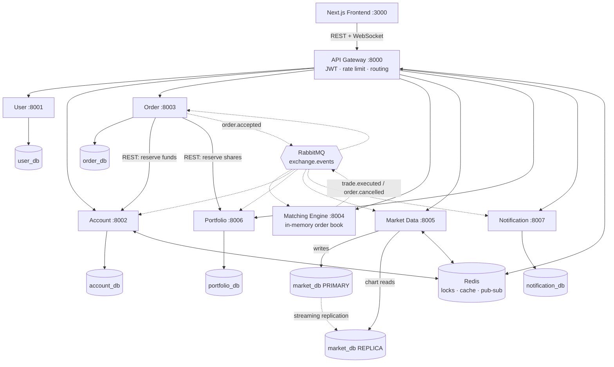

# System Architecture

## Overview



Solid arrows are synchronous HTTP. Dotted arrows are asynchronous events.

## Services and why each one is separate

Each service was judged against one question: **does this responsibility have a
distinct data ownership, scaling need, security boundary, or lifecycle?**

| Service | Port | Owns | Why it is not merged into a neighbour |
|---|---|---|---|
| **User** | 8001 | `user_db` — identities, password hashes | Authentication is a security boundary. Login traffic scales independently of trading traffic. |
| **Account** | 8002 | `account_db` — cash, reservations, ledger | The most consistency-critical part of the system. Isolating it keeps Redis locks and short-lived funds reservations out of every other service. |
| **Order** | 8003 | `order_db` — order lifecycle | Owns the multi-step place-order saga and its compensating actions. Orchestration is a very different concern from the read-optimised market-data path. |
| **Matching Engine** | 8004 | in-memory order books | Latency-sensitive, CPU-bound, correctness-critical. A single-writer in-memory book gives deterministic matching with no lock contention, and allows future sharding by symbol. |
| **Market Data** | 8005 | `market_db` primary + replica | Extremely read-heavy: every connected client polls charts, while writes only happen on a trade. Isolating it allows caching and **master–slave replication**. |
| **Portfolio** | 8006 | `portfolio_db` — holdings, P&L, share reservations | A projection of executed trades needing only eventual consistency — the CQRS read side. |
| **Notification** | 8007 | `notification_db` | Fire-and-forget side effect that must never block the trading path. |

Supporting components — an API Gateway and a message broker — are not business
services but architectural necessities. The gateway centralises cross-cutting
concerns so no service duplicates them; the broker decouples producers from
consumers so a slow consumer (Notification) can never slow down the matching
engine.

## Architectural patterns

### API Gateway
Single entry point on port 8000. Strips `/api`, resolves the longest matching
prefix, validates the JWT and forwards it unchanged, applies a Redis fixed-window
rate limit (30/min on order placement, 120/min otherwise), attaches a request
id, and bridges the market-data WebSocket. `/internal/*` is answered with 404 so
service-to-service endpoints are unreachable from outside.

### Database per service
Seven independent PostgreSQL instances. No service reads another's tables; the
only ways across a boundary are REST and events. Each service owns its own
Alembic migration history.

### Synchronous communication (REST)
Used where the caller cannot proceed without an answer:
`Order → Account` to reserve funds, and `Order → Portfolio` to reserve shares.
Both endpoints are idempotent on `order_id`, so a retry after a timeout can
never double-reserve.

### Asynchronous communication (events)
A durable RabbitMQ topic exchange, `exchange.events`, plus a dead-letter
exchange. Every consumer declares its own queue, so adding a consumer never
steals another's messages. Handlers retry with backoff up to five times and then
dead-letter, so one poison message cannot wedge a queue. See
[events.md](events.md).

### Saga with compensating actions
Placing an order spans three services. The Order Service orchestrates:
reserve → persist → publish, and on any failure it releases the reservation and
marks the order `REJECTED`. See [sequence-place-order.md](sequence-place-order.md).

### CQRS
The write side is orders and trades; the read side is the portfolio projection,
updated asynchronously from `trade.executed`. The trade-off is an eventual
consistency window of a few hundred milliseconds between a fill and the
portfolio reflecting it — deliberate, and surfaced in the UI.

### Master–slave replication
The Market Data database runs a primary and a streaming replica. Trade ingestion
and candle upserts write to the primary; chart and history queries read from the
replica. Reads therefore scale independently of the trading path. If the replica
is unavailable, the service falls back to the primary rather than failing a
chart.

Verify:

```bash
docker compose exec postgres-market-primary psql -U mse -d market_db -c "SELECT client_addr, state, sync_state FROM pg_stat_replication;"
```

```bash
docker compose exec postgres-market-replica psql -U mse -d market_db -c "SELECT pg_is_in_recovery();"
```

### Distributed locking and caching
Redis holds `lock:funds:{user_id}` and `lock:shares:{user_id}:{symbol}`,
acquired with `SET NX PX` and released with a Lua compare-and-delete so an
expired lock is never deleted by its previous holder. It also caches the latest
price per symbol and fans out live ticks over Pub/Sub. Locking **fails closed**:
if Redis is down, a reservation returns 503 rather than proceeding unguarded.

### Service discovery
Docker Compose DNS on the `mse-net` bridge network. Services address each other
by container name (`http://account-service:8002`), never by IP, so containers can
be replaced or rescheduled freely.

## Cross-cutting invariants

- **Money** is `Decimal`, 4 decimal places, `ROUND_HALF_UP`, stored as
  `NUMERIC(18,4)` and transported as a JSON **string**. Never a float. The one
  exception is `/market/candles`, which returns numbers because the charting
  library requires them.
- **Quantity** is a positive integer — whole shares only.
- **Every event handler is idempotent**, guarded by a Redis `SET NX` marker and
  a `processed_events` primary key. Redis alone is insufficient because it can
  be flushed.
- **A failed handler clears its Redis marker before re-raising**, so the broker
  retry actually re-runs the work instead of silently skipping it.
- **`JWT_SECRET` is identical in every container.** Each service logs a SHA-256
  fingerprint of it at startup so a mismatch is visible in the logs rather than
  appearing as unexplained 401s.

## Known limitations

- The order book is in memory, so a matching-engine restart loses resting
  orders. It is rebuilt on boot from the Order Service's open orders.
- Replica lag means a chart read immediately after a trade may miss the newest
  candle. The frontend also applies the live tick, so the user does not see it.
- The gateway rate-limit window is fixed rather than sliding, so a burst
  straddling a minute boundary can briefly allow up to twice the limit.
- `processed_events` grows without bound; production would prune old rows.
