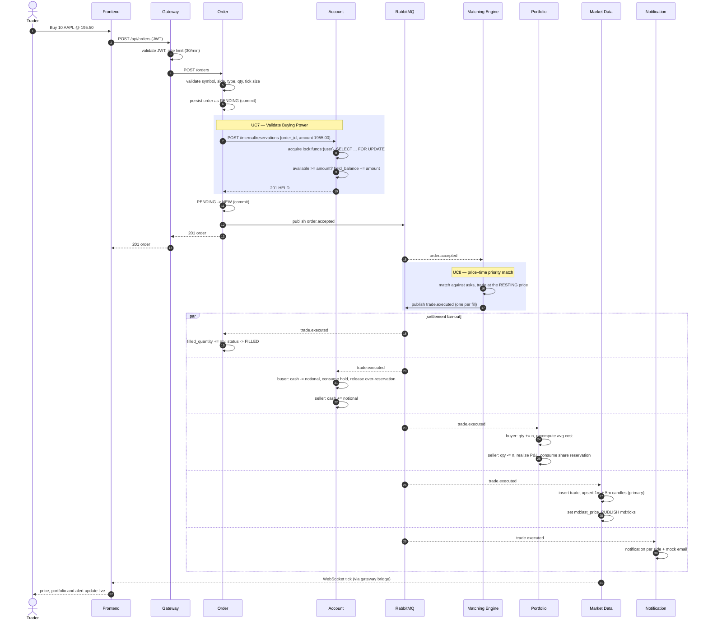
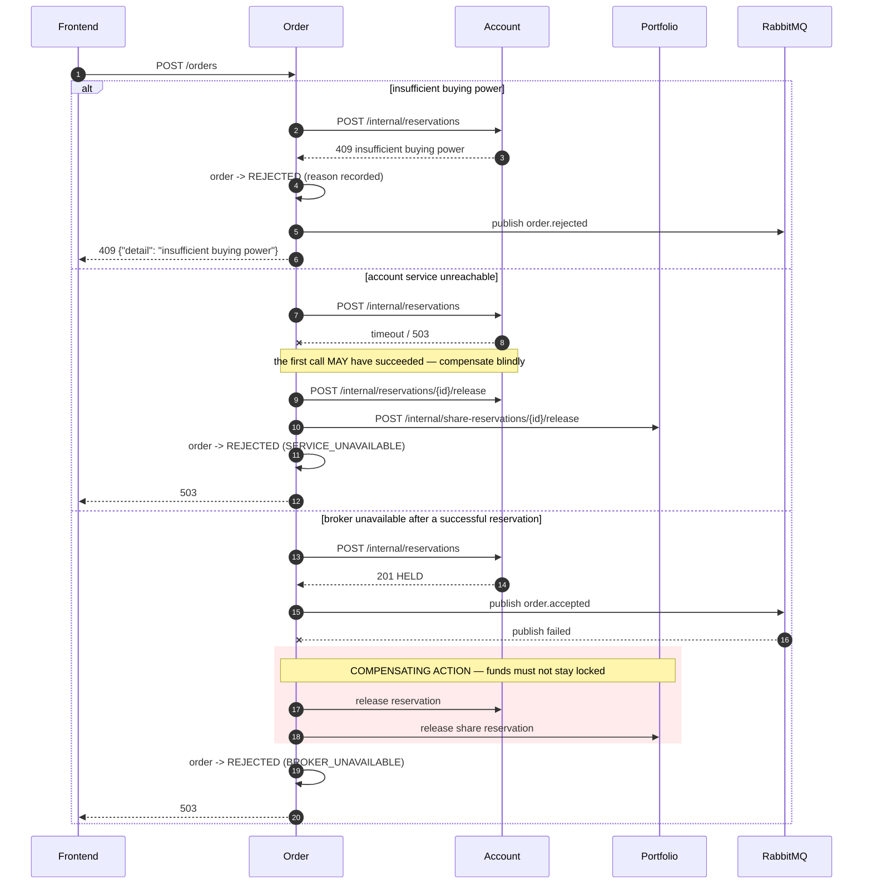
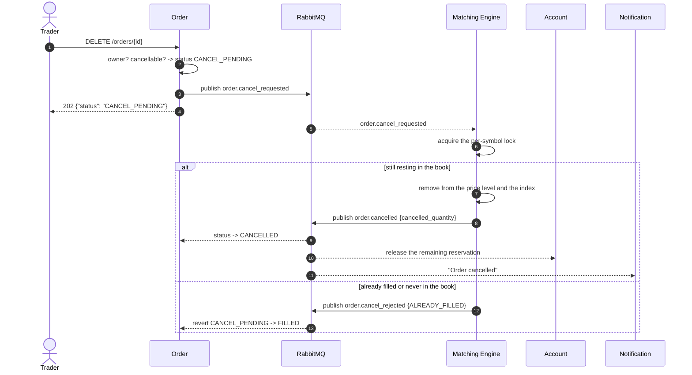

# Sequence: Place Order (the saga)

## Happy path — limit buy that matches

**Note on step ordering.** The order is persisted as `PENDING` *before* the
reservation, because the reservation is idempotent on `order_id` and therefore
needs the id to exist first. That is what makes a retried call safe.

**Note on the trade price.** The trade executes at the **resting** order's
price, so an aggressor bidding 196.00 against a resting ask of 195.50 pays
195.50. The buyer reserved against 196.00, so the difference stays held until
the order finishes and is then released — which is why `buy_order_limit_price`
travels in the event.

## Failure path — compensating actions

Both release endpoints are **idempotent and safe when nothing was reserved** —
they return `released: 0` rather than 404 — so the Order Service can compensate
blindly without first working out how far it got.

## Cancellation — two-phase, because the book is the authority

**Why not let the Order Service publish `order.cancelled` directly?** Only the
book knows whether the order was still resting when the cancel arrived. If funds
were released optimistically, a fill landing in the same millisecond would
settle against a reservation that no longer exists. Routing the cancel through
the engine — where it takes the same per-symbol lock as matching — makes the two
strictly ordered and the compensation race-free.
