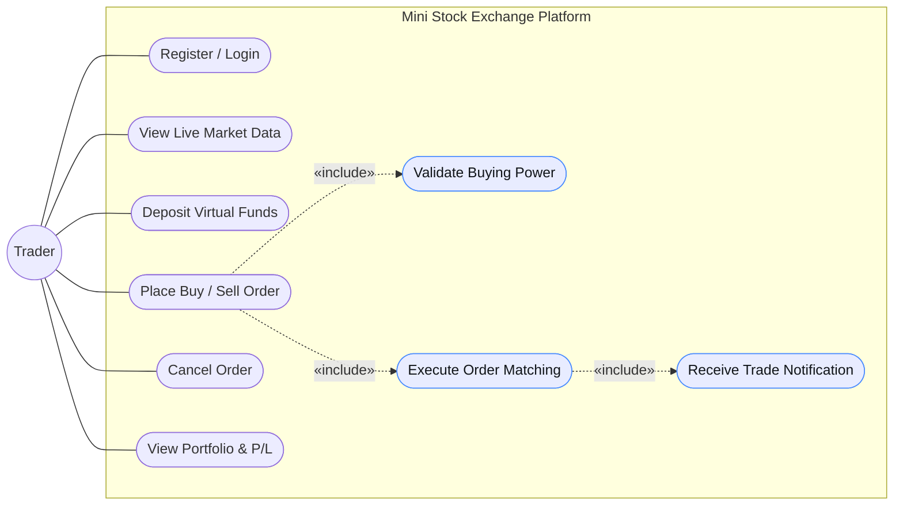

# Use Cases

Primary actor: **Trader**. The three shaded use cases on the right are never
invoked directly — they are `«include»` relationships pulled in by the main ones.

## Use case detail

### UC1 — Register / Login
**Service:** User (8001)
Registers with email, username and password (bcrypt, 12 rounds), or logs in via
the OAuth2 password flow with either the email or the username. Returns a JWT
valid for 24 hours.
*Alternate flows:* duplicate email → 409; wrong password → 401, indistinguishable
from an unknown user; disabled account → 403.

### UC2 — View Live Market Data
**Services:** Market Data (8005), Matching Engine (8004)
Historical 1m/5m OHLC candles are served from the **read replica**; live price
ticks arrive over a WebSocket bridged by the gateway; the order book depth comes
from the matching engine. No login required.
*Alternate flows:* unknown symbol → 404; a symbol with no trades yet → empty
candle set and a "no activity" panel; replica unreachable → transparent fallback
to the primary.

### UC3 — Deposit Virtual Funds
**Service:** Account (8002)
Adds virtual cash and writes a ledger entry. Amount must be positive, at most
1,000,000, and no more than 2 decimal places.
*Alternate flows:* zero, negative, non-numeric or over-precise amount → 400.

### UC4 — Place Buy / Sell Order
**Services:** Order (8003) → Account (8002) / Portfolio (8006) → Matching Engine (8004)
Validates the order, reserves the resource it needs, persists it, and publishes
`order.accepted`. **Includes UC7 and UC8.**
*Alternate flows:* insufficient buying power → 409 and the order is recorded as
`REJECTED`; insufficient shares → 409; market order with no reference price →
rejected; broker unavailable after the reservation → compensating release, 503.

### UC5 — Cancel Order
**Services:** Order (8003) → Matching Engine (8004) → Account / Portfolio
Two-phase: the Order Service marks the order `CANCEL_PENDING` and publishes
`order.cancel_requested`; the matching engine removes it from the book and
publishes the authoritative `order.cancelled`, which releases the reservation.
*Alternate flows:* already filled → `cancel_rejected` and the order returns to
`FILLED`; someone else's order → 403; already cancelled → 409.

### UC6 — View Portfolio & P/L
**Service:** Portfolio (8006)
Holdings with quantity, available quantity, weighted average cost, market value,
unrealized and realized P&L. Market value is marked against the latest price
cached in Redis.
*Alternate flows:* no mark price available → marked at average cost, unrealized
P&L 0, flagged `price_stale`.

### UC7 — Validate Buying Power `«include»`
**Service:** Account (8002)
Acquires a Redis lock on the user's balance, checks
`cash_balance - held_balance >= amount`, and reserves the funds. The lock is what
prevents the same cash being spent twice from two concurrent sessions. The
symmetric check for sells reserves *shares* in the Portfolio Service, which is
what prevents naked shorting.

### UC8 — Execute Order Matching `«include»`
**Service:** Matching Engine (8004)
Matches against the opposite side of the book by **price–time priority**. Trades
execute at the resting order's price, so the aggressor receives any price
improvement. Self-trades are skipped. A limit remainder rests in the book; a
market remainder is cancelled (immediate-or-cancel). **Includes UC9.**

### UC9 — Receive Trade Notification `«include»`
**Service:** Notification (8007)
Consumes `trade.executed`, `order.cancelled` and `order.rejected` and creates an
in-app notification per affected user plus a mock email log line. Entirely
asynchronous — the trading path never waits on it.
